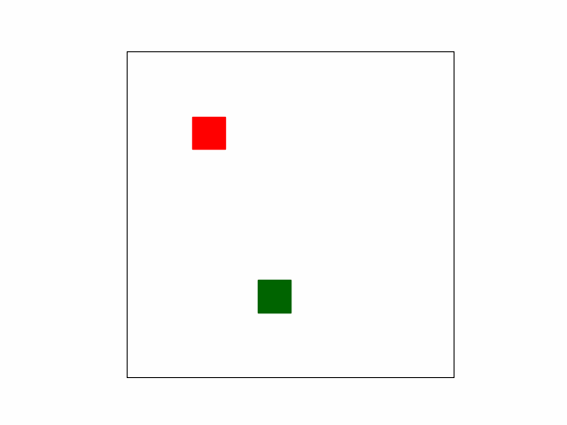
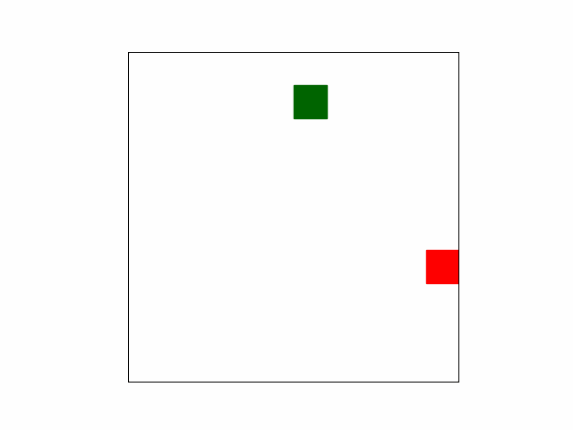
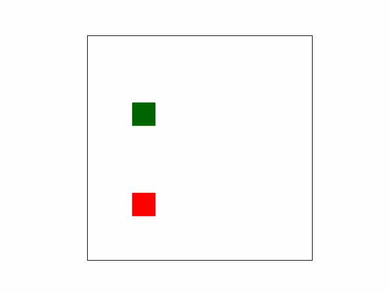
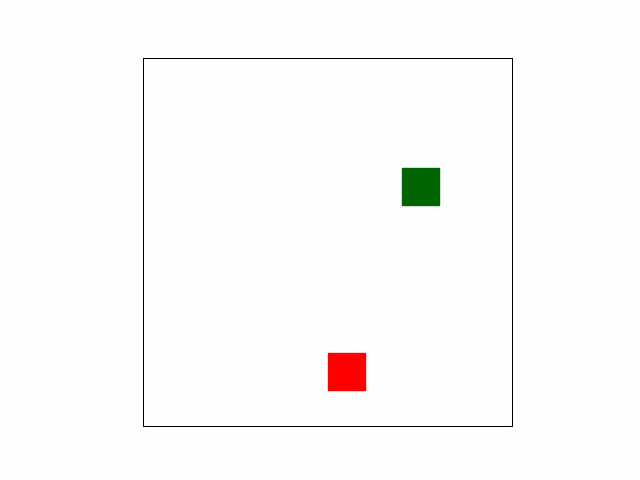
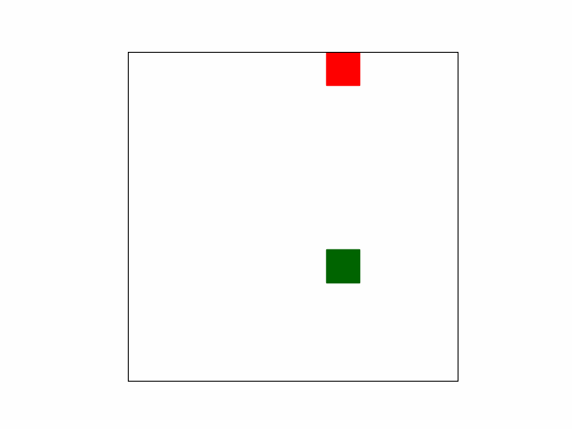
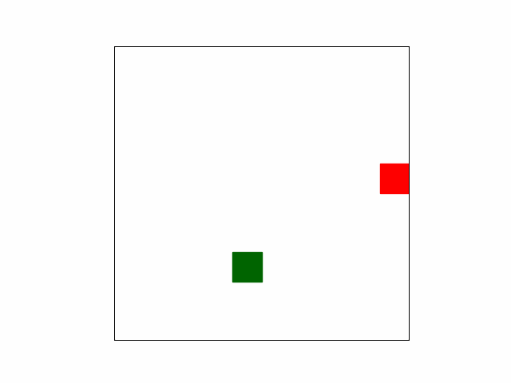
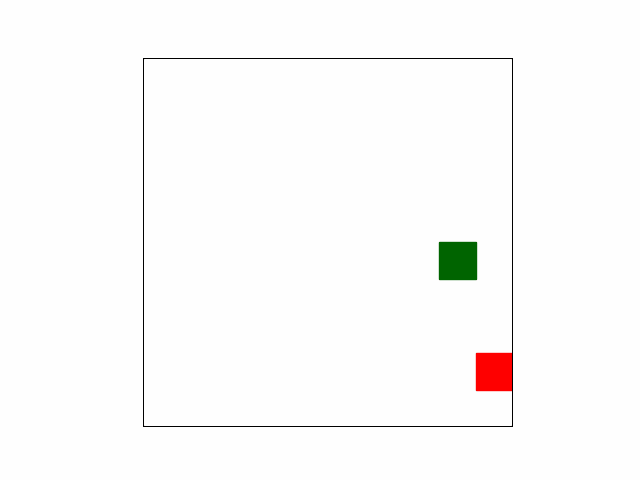
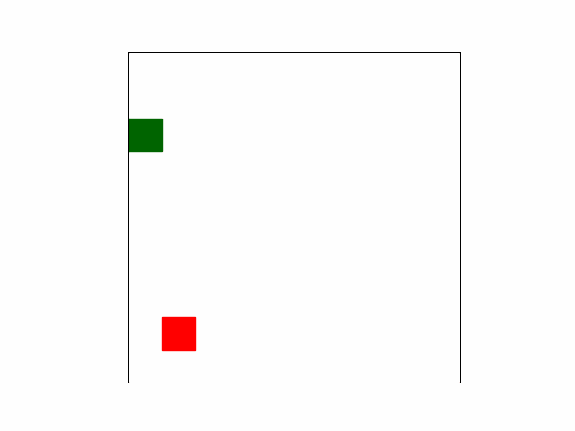

# nanoNEAT
A minimal python implementation of NeuroEvolution of Augmenting Topologies(NEAT)

 |  |  | 
|:-------------------------:|:-------------------------:|:-------------------------:|:-------------------------:|
 |  |  | 

# Implementation

The implementation contains two entities Genome and a Network, a network is a neural network

# To Do
- [ ] Genetic encoding
- [ ] Convert genetic material to functional networks
- [ ] Handle mating and mutations
- [ ] Handle collections of genomes
- [ ] A environment to simulate all the things